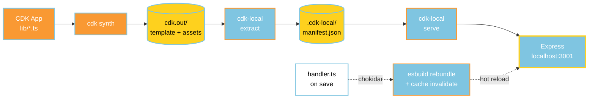

## How it works

1. `cdk synth` produces `cdk.out/` with your stack template and asset manifest.
2. `cdk-local extract` parses that output into a self-contained manifest: routes, Lambda handlers, per-route authorizers, and each Lambda's TypeScript entry path (recovered from esbuild bundle markers).
3. `cdk-local serve` boots an Express server from the manifest, registers all routes, invokes authorizers per-request, and hot-reloads handlers on file save.

### Request lifecycle on the local server

```mermaid
flowchart TD
    Req[HTTP request<br/>GET /users/42]:::req --> Match{Route<br/>match?}:::decision
    Match -- literal wins --> Lit[/users/me handler/]:::handler
    Match -- parameterized --> Param[/users/&#123;id&#125; handler/]:::handler
    Match -- no match --> NF[404]:::err
    Lit --> Auth{Authorizer<br/>configured?}:::decision
    Param --> Auth
    Auth -- yes --> Authz[Invoke authorizer Lambda]:::tool
    Authz -- allow --> Invoke[Invoke handler<br/>esbuild-bundled]:::tool
    Authz -- deny --> Denied[401 / 403]:::err
    Auth -- no --> Invoke
    Invoke --> Resp[HTTP response]:::req

    classDef req fill:#7fc5e1,stroke:#f99933,stroke-width:2px,color:#fff
    classDef decision fill:#fed11e,stroke:#7fc5e1,stroke-width:2px,color:#000
    classDef handler fill:#fff,stroke:#7fc5e1,stroke-width:2px,color:#000
    classDef tool fill:#f99933,stroke:#7fc5e1,stroke-width:2px,color:#fff
    classDef err fill:#fff,stroke:#f99933,stroke-width:2px,color:#000
```

