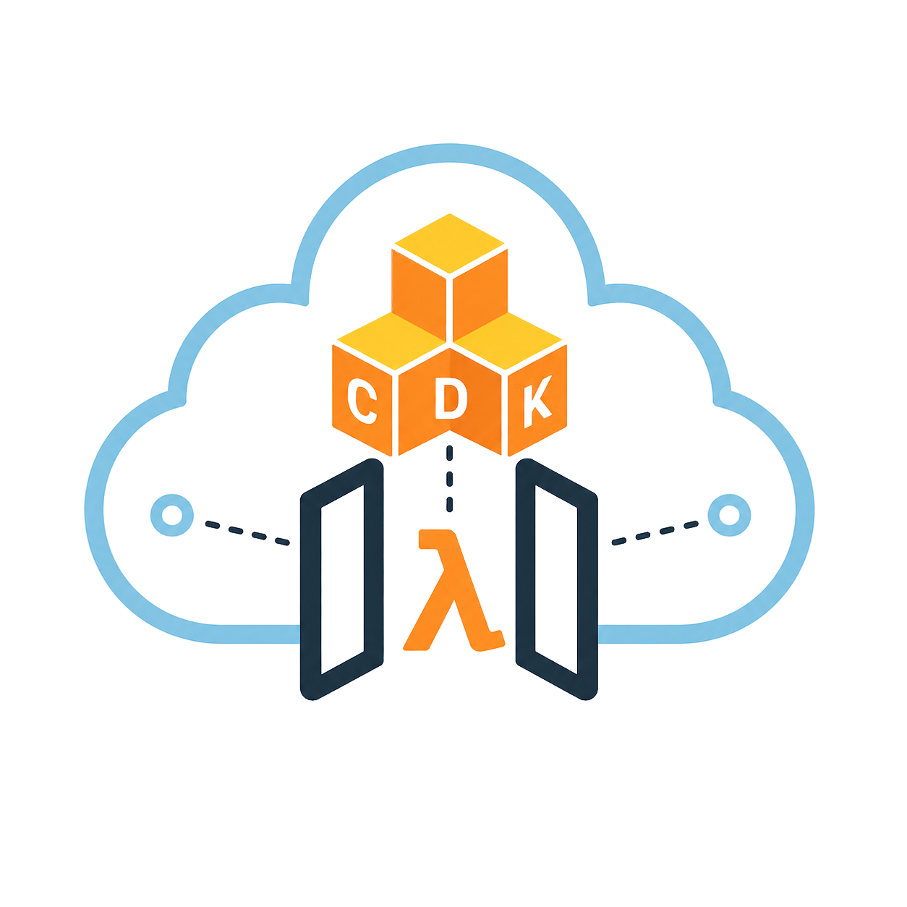

<div align="center">



# aws-cdk-local-lambda

**Run your CDK API Gateway + Lambda stack locally over HTTP - no mocks, no handler registry.**
Reads `cdk synth` output directly and boots a local Express server that mirrors your deployed routes, with hot reload.

[](https://github.com/tiny-build/aws-cdk-local-lambda/actions/workflows/release.yml)
[](https://www.npmjs.com/package/aws-cdk-local-lambda)
[](https://www.npmjs.com/package/aws-cdk-local-lambda)
[](https://github.com/tiny-build/aws-cdk-local-lambda/stargazers)

### Built with


</div>

---

## Why this exists

Iterating on a CDK-deployed API usually means waiting for `cdk deploy`, or wiring up SAM/LocalStack with a handler registry that drifts from your real stack. `aws-cdk-local-lambda` skips all of that:

- **Reads `cdk synth` directly** - your stack template is the source of truth.
- **Real Express server** - no mocks, no registry, no fake invoke.
- **Hot reload** - handlers re-bundle on save, no process restart.
- **Authorizers per route** - invoked exactly like API Gateway does.

## Install

```bash
npm install aws-cdk-local-lambda
```
or
```bash
pnpm add aws-cdk-local-lambda
```

## Quickstart

> [!TIP]
> **First time?** Just run `npx cdk-local init` from your CDK project root. The interactive wizard handles install, `cdk synth`, manifest extraction, and starts the dev server - all in one flow.

```bash
npx cdk-local init
```

The wizard will:

1. **Auto-detect** your CDK app (looks for `cdk.json` + `aws-cdk-lib`).
2. **List stacks** via `cdk ls` and let you pick one.
3. **Prompt** for stage, log level, and log output (stdout vs file).
4. **Install** `aws-cdk-local-lambda` as a dev dependency using your detected package manager (npm / pnpm / yarn / bun).
5. **Run `cdk synth`** and extract the manifest to `.cdk-local/manifest.json`.
6. **Persist** your choices to `.cdk-local/config.json` and add `.cdk-local/` to `.gitignore`.
7. **Boot** the local server on port `3001` with hot reload.

> [!NOTE]
> After `init`, subsequent runs only need `npx cdk-local dev` (or `serve` if your routes haven't changed) - your config is read from `.cdk-local/config.json`.

## CLI reference

If you'd rather wire things up manually, the lower-level commands are available too:

### All-in-one: extract + serve (uses .cdk-local/config.json if present)
```bash
npx cdk-local dev --stack MyStack --stage dev --port 3001
```

### Step 1 - parse cdk.out into a manifest file
```bash
npx cdk-local extract --cdk-out cdk.out --stack MyStack --stage dev --out .cdk-local/manifest.json
```

### Step 2 - start the local server from that manifest
```bash
npx cdk-local serve --manifest .cdk-local/manifest.json --port 3001 --watch
```

**When to keep them separate:** if your handlers don't change between runs, reuse the same manifest and skip re-running `cdk synth`. Only re-extract when you add or rename a handler - the server hot-reloads handler code on save.

| Command   | Purpose                                                              | Watch default                |
|-----------|----------------------------------------------------------------------|------------------------------|
| `init`    | Interactive wizard: install + `cdk synth` + extract + serve          | on                           |
| `dev`     | `extract` + `serve` in one step                                      | on (`--no-watch` to disable) |
| `extract` | Parse `cdk.out` → `LocalManifest` JSON (pass `--synth` to run synth) | n/a                          |
| `serve`   | Boot Express from a pre-built manifest                               | opt-in (`--watch`)           |

> [!IMPORTANT]
> `init` shells out to the AWS CDK CLI. Make sure `cdk` is available on your `PATH` (see the [AWS CDK Getting Started guide](https://docs.aws.amazon.com/cdk/v2/guide/getting-started.html)) or that the wizard is invoked inside a project where `cdk` resolves.

## Contributing

Contributions are welcome - small PRs, clear commits, conventional commits enforced.

- [CONTRIBUTING.md](CONTRIBUTING.md) - pull request workflow and expectations

## License

[MIT](LICENSE) © tiny-build
