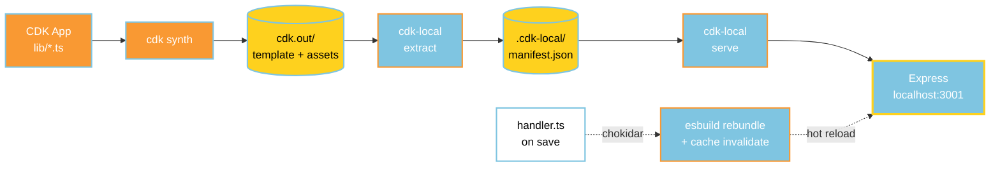

<div align="center">


# cdk-lambda-local

**Run an API Gateway + Lambda app locally over HTTP, driven entirely by `cdk synth` output.**
No handler registry. No mocks. Hot reload on save.

[](https://github.com/tiny-build/cdk-lambda-local/actions/workflows/ci.yml)
[](https://www.npmjs.com/package/cdk-lambda-local)
[](https://www.npmjs.com/package/cdk-lambda-local)
[](https://github.com/tiny-build/cdk-lambda-local/stargazers)
[](https://github.com/tiny-build/cdk-lambda-local/blob/main/LICENSE)

### Built with


</div>

---

## What it does

- **Reads `cdk synth` directly** — your stack template is the source of truth.
- **Real Express server** — no handler registry, no mocked invoke.
- **Hot reload** — `.ts` handlers are esbuild-bundled on save, no restart.
- **Per-route authorizers** — invoked exactly like API Gateway.

## How it works



1. `cdk synth` produces `cdk.out/` with your stack template and asset manifest.
2. `cdk-local extract` parses that output into a self-contained manifest: routes, Lambda handlers, per-route authorizers, and each Lambda's TypeScript entry path (recovered from esbuild bundle markers).
3. `cdk-local serve` boots an Express server from the manifest, registers all routes, invokes authorizers per-request, and hot-reloads handlers on file save.

### Request lifecycle on the local server

```mermaid
flowchart TD
    Req[HTTP request<br/>GET /users/42]:::req --> Match{Route<br/>match?}:::decision
    Match -- literal wins --> Lit[/users/me handler/]:::handler
    Match -- parameterized --> Param[/users/&#123;id&#125; handler/]:::handler
    Match -- no match --> NF[404]:::err
    Lit --> Auth{Authorizer<br/>configured?}:::decision
    Param --> Auth
    Auth -- yes --> Authz[Invoke authorizer Lambda]:::tool
    Authz -- allow --> Invoke[Invoke handler<br/>esbuild-bundled]:::tool
    Authz -- deny --> Denied[401 / 403]:::err
    Auth -- no --> Invoke
    Invoke --> Resp[HTTP response]:::req

    classDef req fill:#7fc5e1,stroke:#f99933,stroke-width:2px,color:#fff
    classDef decision fill:#fed11e,stroke:#7fc5e1,stroke-width:2px,color:#000
    classDef handler fill:#fff,stroke:#7fc5e1,stroke-width:2px,color:#000
    classDef tool fill:#f99933,stroke:#7fc5e1,stroke-width:2px,color:#fff
    classDef err fill:#fff,stroke:#f99933,stroke-width:2px,color:#000
```



## Install

```bash
npm install cdk-lambda-local
```
or
```bash
pnpm add cdk-lambda-local
```

> Requires **Node.js ≥ 22.14**.

## Get started in one command

> [!TIP]
> The fastest way in is `npx cdk-local init` — an interactive wizard that installs the package, runs `cdk synth`, extracts the manifest, and boots the server.

```bash
npx cdk-local init
```

The wizard:

1. Auto-detects your CDK app (`cdk.json` + `aws-cdk-lib`). Prompts you to pick if multiple are found.
2. Runs `cdk ls` and lets you pick a stack.
3. Prompts for **stage**, **log level** (`trace` → `error`), and **log output** (`stdout` or file at `.cdk-local/logs/dev.log`).
4. Detects your package manager (npm / pnpm / yarn / bun) and installs `cdk-lambda-local` as a dev dependency. Skips if already installed.
5. Runs `cdk synth` and extracts to `.cdk-local/manifest.json`.
6. Writes your choices to `.cdk-local/config.json` and appends `.cdk-local/` to `.gitignore`.
7. Starts the dev server on port `3001` with hot reload and the live dashboard.

> [!NOTE]
> `init` reads variables from a `.env` next to your `cdk.json` (if present) when invoking `cdk ls` / `cdk synth`. Subsequent runs can just use `cdk-local dev` — `dev` and `serve` will pick up `stack`, `stage`, and `manifestPath` from `.cdk-local/config.json`.

> [!IMPORTANT]
> `init` shells out to the AWS CDK CLI. Make sure `cdk` is available on your `PATH` (`npm i -g aws-cdk`) or that the wizard is invoked inside a project where `cdk` resolves.

## CLI reference

```
cdk-local init
cdk-local dev     [--cdk-out <dir>] [--stack <name>] [--stage <env>] [--port 3001] [--no-watch]
cdk-local extract  --cdk-out <dir>   --stack <name>   --stage <env>  [--out <file>] [--synth]
cdk-local serve   [--manifest <file>] [--port 3001] [--watch]
```

| Command   | Purpose                                                              | Watch default      |
|-----------|----------------------------------------------------------------------|--------------------|
| `init`    | Interactive setup wizard: install + synth + extract + serve.         | on                 |
| `dev`     | `extract` + `serve` in one step. Reads defaults from config.         | on (`--no-watch`)  |
| `extract` | Writes a v2 `LocalManifest` JSON to `--out` (or stdout).             | n/a                |
| `serve`   | Reads a pre-extracted manifest and starts the server.                | opt-in (`--watch`) |

Pass `--synth` to `extract` to run `cdk synth` first (useful after cloning to a new path, since esbuild embeds absolute source paths in bundles).

### Config file

After `init`, your project gets a `.cdk-local/config.json` like:

```json
{
  "cdkRoot": "/abs/path/to/cdk-app",
  "stack": "MyStack",
  "stage": "dev",
  "logLevel": "info",
  "logOutput": "stdout",
  "manifestPath": ".cdk-local/manifest.json"
}
```

`dev` and `serve` fall back to these values when CLI flags are omitted.

## Programmatic

```ts
import { extractManifest } from 'cdk-lambda-local/extract';
import { createLocalApp } from 'cdk-lambda-local/server';

const manifest = await extractManifest({
  cdkOut: 'infra/cdk.out',
  stack: 'MyStack',
  stage: 'dev',
});

const { app, routes, stop } = await createLocalApp({
  manifest,
  watch: true,
  onReload: (path, count) => console.log(`reloaded (${count}) after ${path}`),
});

app.listen(3001);
```

### Running your handlers

Run the consumer process with `tsx` (or equivalent) so dynamic `import()` of `.ts` entries works:

```bash
pnpm exec tsx api/scripts/serve-local.ts
```

## Hot reload

On any file change under the watched paths (default: derived from each Lambda's manifest `entry`, walked up to the nearest `src/` ancestor), the loader invalidates its handler cache.

For `.ts` / `.tsx` entries under a standard `api/` tree, the next load **esbuild-bundles** the handler into a short-lived file under `node_modules/.cache/cdk-lambda-local/` at the monorepo root and imports that bundle, so you always run code that matches the files on disk (tsx's own transform cache is not used on that path). Other entry types still use dynamic `import()` with a cache-busting query.

No process restart. Recovery from bundle markers happens at `extract` time only.

## Route specificity

Literal routes win over parameterized routes at the same depth. For example, if both `/users/me` and `/users/{id}` are registered, `GET /users/me` matches the literal handler, while `GET /users/42` falls through to the parameterized one — matching API Gateway's behavior.

## What this package does NOT do

- Load `.env` files or set `AWS_REGION` defaults — that's the consumer's job.
- Call `app.listen` from `createLocalApp` — the consumer owns the port and lifecycle.
- Know about any repo-specific naming conventions (function prefixes, authorizer keys, etc.).

## Resources
- [Example stack](https://github.com/tiny-build/cdk-lambda-local/tree/main/examples/simple-crud)

## License

[MIT](https://github.com/tiny-build/cdk-lambda-local/blob/main/LICENSE) © tiny-build
